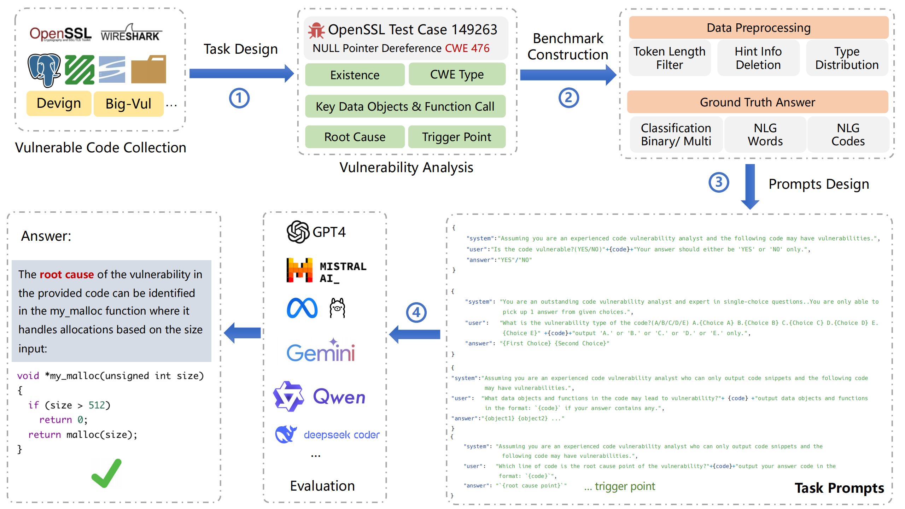
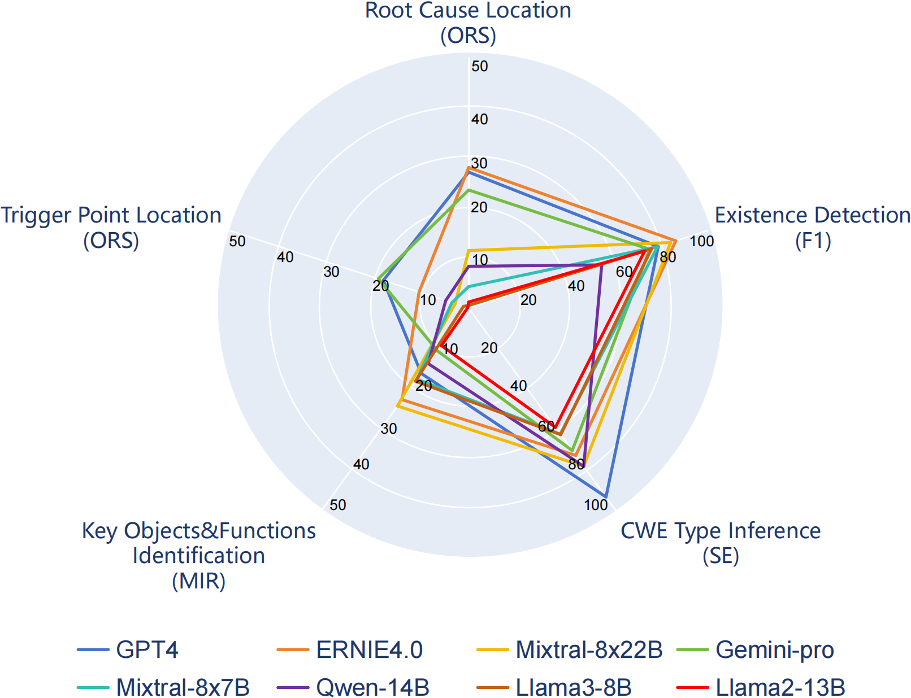

# VulDetectBench

> Official code for paper "[VulDetectBench: Evaluating the Deep Capability of Vulnerability Detection with Large Language Models](https://arxiv.org/abs/2406.07595)".

VulDetectBench is a benchmark designed to evaluate the vulnerability detection capabilities of Large Language Models (LLMs).

[](https://pypi.org/project/vuldetectbench/)
[](./LICENSE)


## Overview

While LLMs excel in code comprehension and generation, their ability to detect program vulnerabilities has been less explored. VulDetectBench addresses this by assessing LLMs through five increasingly difficult tasks.

### Dataset Curation

<div align=center>
  
</div>

<div align=center>VulDetectBench Curation Pipeline.</div>

### Experiment Results

Our test results shows that **existing LLMs perform well on simple analysis tasks such as vulnerability existence detection and CWE type inference, while on specific vulnerability related tasks, although performance varies from LLM to LLM, the overall performance is not yet satisfactory.**

<div align=center>
  
</div>

<div align=center>Top 8 LLMs' ability on Vulnerability Detections.</div>

## VulDetectBench

<details>
    <summary>Task1:Vulnerability Existence Detection</summary>

### Statistics

| Number of Samples | Vulnerability Types | Minimal Token Count | Maximal Token Count |
| :---------------: | :-----------------: | :-----------------: | :-----------------: |
|       1000       |         48         |         50         |        3493        |

### Format

```
{
    "system":"Assuming you are an experienced code vulnerability analyst and the following code may have vulnerabilities.",
    "user":"Is the code vulnerable?(YES/NO)"+{code}+"Your answer should either be 'YES' or 'NO' only.",
    "answer":"YES"/"NO"
}
```

### Metrics

- For a single testcase,we will show:

  - `hit`:Whether the model correctly classifies the case.
- For overall performance,we will show:

  - `Accuracy` on the entire benchmark
  - `F1-Score` on the entire benchmark

</details>

<details>
    <summary>Task2:Vulnerability Type Inference</summary>

### Statistics

| Number of Samples | Vulnerability Types | Minimal Token Count | Maximal Token Count |
| :---------------: | :-----------------: | :-----------------: | :-----------------: |
|        500        |         48         |         265         |        3372        |

### Format

```
{
    "system": "You are an outstanding code vulnerability analyst and expert in single-choice questions.You are only able to pick up 1 answer from given choices.",
    "user": "What is the vulnerability type of the code?(A/B/C/D/E)
      A.~
      B.~
      C.~
      D.~
      E.~", + {code}+"output 'A.' or 'B.' or 'C.' or 'D.' or 'E.' only.",
    "answer":"X|Y"//(X is optimal option，Y is sub-optimal option)
}
```

### Metrics

- For a single sample,we will show:

  - `Strict Evaluation Score(SE)`:When the model hits X,SE=1;When the model hits Y,SE=0.5.Otherwise SE=0.
  - `Moderate Evaluation Score(ME)`:When the model hits X or Y,ME=1;Otherwise ME=0.
- For overall performance,we will show:

  - `Average SE` on the entire benchmark
  - `Average ME` on the entire benchmark

</details>

<details>
    <summary>Task3:Key Objects & Functions Identification</summary>

### Statistics

| Number of Samples | Vulnerability Types | Minimal Token Count | Maximal Token Count |
| :---------------: | :-----------------: | :-----------------: | :-----------------: |
|        100        |         38         |        1017        |        3269        |

### Format

```
{
    "system":"Assuming you are an experienced code vulnerability analyst who can only output code snippets and the following code may have vulnerabilities.",
    "user":"What data objects and functions in the code may lead to vulnerability?"+{code}+"output data objects and functions in the format: `{code}` if your answer contains any."
    "answer":"{object1} {object2} ..."
}
```

### Metrics

- For a single sample,we will show:

  - `Token Recall`:Number of correct tokens in model's output/Number of gold tokens in the answer.
- For overall performance,we will show:

  - `Macro Average Recall(MAR)`:

  $$
  athrm{MAR}=\frac{1}{n}\sum_{i=1}^n(\frac{TP_i}{TP_i+FN_i})
  $$

  - `Micro Average Recall(MIR)`:

  $$
  athrm{MIR}=\frac{\sum_{i=1}^n TP_i}{\sum_{i=1}^n(TP_i+FP_i)}
  $$

</details>

<details>
    <summary>Task4:Root Cause Location</summary>

### Statistics

| Number of Samples | Vulnerability Types | Minimal Token Count | Maximal Token Count |
| :---------------: | :-----------------: | :-----------------: | :-----------------: |
|        100        |         38         |        1010        |        3262        |

### Format

```
{
    "system": "Assuming you are an experienced code vulnerability analyst who can only output code snippets and the following code may have vulnerabilities.",
    "user":"Which line of code is the root cause point of the vulnerability?"+{code}"output your answer code in the format: `{code}`",
    "answer":`{root cause point}`
}
```

### Metrics

- For a single sample,we will show:

  - `Union line-of-code recall score(URS)`:

  $$
  athrm{URS}=\frac{\mathrm{Line_{output}\cap Line_{answer}}}{\mathrm{Line_{output}\cup Line_{answer}}}
  $$

  - `Original line-of-code recall score(ORS)`:

  $$
  athrm{ORS}=\frac{\mathrm{Line_{output}\cap Line_{answer}}}{\mathrm{Line_{answer}}}
  $$
- For overall performance,we will show:

  - `Average URS` on the entire benchmark
  - `Average ORS` on the entire benchmark

</details>

<details>
    <summary>Task5:Trigger Point Location</summary>

### Statistics

| Number of Samples | Vulnerability Types | Minimal Token Count | Maximal Token Count |
| :---------------: | :-----------------: | :-----------------: | :-----------------: |
|        100        |         38         |        1011        |        3363        |

### Format

```
{
    "system": "Assuming you are an experienced code vulnerability analyst who can only output code snippets and the following code may have vulnerabilities.",
    "user":"Which line of code is the trigger point of the vulnerability?"+{code}"output your answer code in the format: `{code}`",
    "answer":`{trigger point}`
}
```

### Metrics

- For a single sample,we will show:

  - `Union line-of-code recall score(URS)`:

  $$
  athrm{URS}=\frac{\mathrm{Line_{output}\cap Line_{answer}}}{\mathrm{Line_{output}\cup Line_{answer}}}
  $$

  - `Original line-of-code recall score(ORS)`:

  $$
  athrm{ORS}=\frac{\mathrm{Line_{output}\cap Line_{answer}}}{\mathrm{Line_{answer}}}
  $$
- For overall performance,we will show:

  - `Average URS` on the entire benchmark
  - `Average ORS` on the entire benchmark

</details>

## How to use

#### Step 1

To get the test sets,you can clone this repository:

    git clone https://github.com/Sweetaroo/VulDetectBench.git

the dataset is under `VulDetectBench/dataset/test`.

To install the library,you can use `pip`

    pip install vuldetectbench

Then,to prepare for testing metrics,run the following code on your terminal:

    python

    >>> import nltk

    >>> nltk.download('punkt_tab')

#### Step 2

`vuldetectbench`is used in python programs.

To run the benchmarks on your model,you first need to create a subclass of class `Agent`(expressed as `SubAgent`),which is used for answer generation of your model.Typically the subclass is composed of 2 methods,`__init__` and `__call__`.

- `__init__`:is used for model setup.You should implement everything necessary in this method,such as loading tokenizers,model deployment,api agent creation,etc.
- `__call__`:is only used for answer generation.It receives 1 additional parameter `prompt` which is formatted as follows:

```json
{
    "system":"Assuming you are an experienced code vulnerability analyst...",
    "user": "Which line of code is ...?"
}
```

`__call__` returns a plain `str`,the model's output.

#### Step 3

Create instances from class `SubAgent`,`Tasks` and `VulDetectBench_Engine`.

```python
    from vuldetectbench.generation import Tasks,Agent,VulDetectBench_Engine

    model=SubAgent()
  
    tasks=Tasks(data_dir='...',task_no=...,method=...)
  
    engine=VulDetectBench_Engine(
                model=model,
                task_and_metrics=tasks
                save_path='...',
                verbose=...)
```

Here's a simple explanation of the parameters:

| Param         | type               | Usage                                                                                                                                                            |
| ------------- | ------------------ | ---------------------------------------------------------------------------------------------------------------------------------------------------------------- |
| `data_dir`  | str                | determine where the test data is                                                                                                                                 |
| `task_no`   | int,List[int],None | determine which task(s) to take.None:take all tasks at once.int:task one specific task.List[int]:take specific tasks,2 or above.                                 |
| `save_path` | str,None           | determine the path for saving evaluation reports.None:do not save,output in the terminal.str:save under a specific path.                                         |
| `verbose`   | bool               | True:generate detailed reports,contains score on each sample and the entire benchmark.False:generate simple reports,only contains score on the entire benchmark. |
| `method` | str['cot','few-shot'],None |None(default):using default prompting strategy in all tasks;'cot':using Chain-of-Thought prompting strategy in task3,4 and 5;'few-shot':using few-shot(2-shot) prompting stategy in task3,4 and 5.|
#### Step 4

execute `engine.run()` to perform tasks.

[./demos/gpt.py](./demos/gpt.py) suggests a simple demo to run VulDetectBench using GPT-3.5-Turbo API.

## Reference

If you use or reference our work,please cite our paper.

```bibtex
@misc{liu2024vuldetectbenchevaluatingdeepcapability,
      title={VulDetectBench: Evaluating the Deep Capability of Vulnerability Detection with Large Language Models}, 
      author={Yu Liu and Lang Gao and Mingxin Yang and Yu Xie and Ping Chen and Xiaojin Zhang and Wei Chen},
      year={2024},
      eprint={2406.07595},
      archivePrefix={arXiv},
      primaryClass={cs.CR},
      url={https://arxiv.org/abs/2406.07595}, 
}
```
